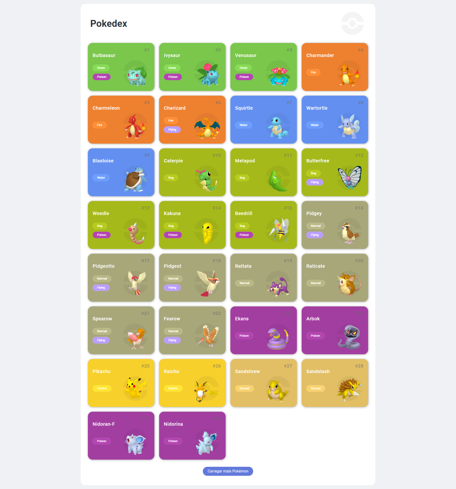

## 🏋️‍♂️ Desafio de Projeto HTML + CSS + JavaScript: Construindo uma Pokédex com JavaScript.

Desafio de projeto proposto para criação de uma pokédex utilizando HTML, CSS e JavaScript.   
Os temas abordados são: 

- Método. 
- Conceitos de mobile first.
- Utilização e funcionamento de API´s.
- Unidades de medidas.
- Responsividade. 

Além de outros recursos.

## 💻 Tecnologias utilizadas nesse projeto:

  
  
  

## 💻 Preview:
- Veja como ficou o projeto:
  

## 🤔 O que aprendi com esse projeto:
- Aprimorar minhas habilidades em HTML, CSS e JavaScript.
- Utilizar uma API.
- Construção de uma function para manipulação do HTML. 
- Estilização de listas, centralização de texto e boas práticas de design.
- Utilizar os recursos de responsividade.

## 📌 Créditos
- **Curso:** ✨ Criando um Projeto com HTML/CSS para Listagem de Pokémon, no seguinte endereço:
  [Formação JavaScript Developer](https://web.dio.me/track/formacao-javascript-developer)
  
- **Design:** Saepul Nahwan -  no seguinte endereço:
  [Pokedex App](https://dribbble.com/shots/6540871-Pokedex-App/attachments/6540871-Pokedex-App?mode=media)
  
